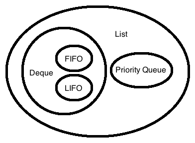
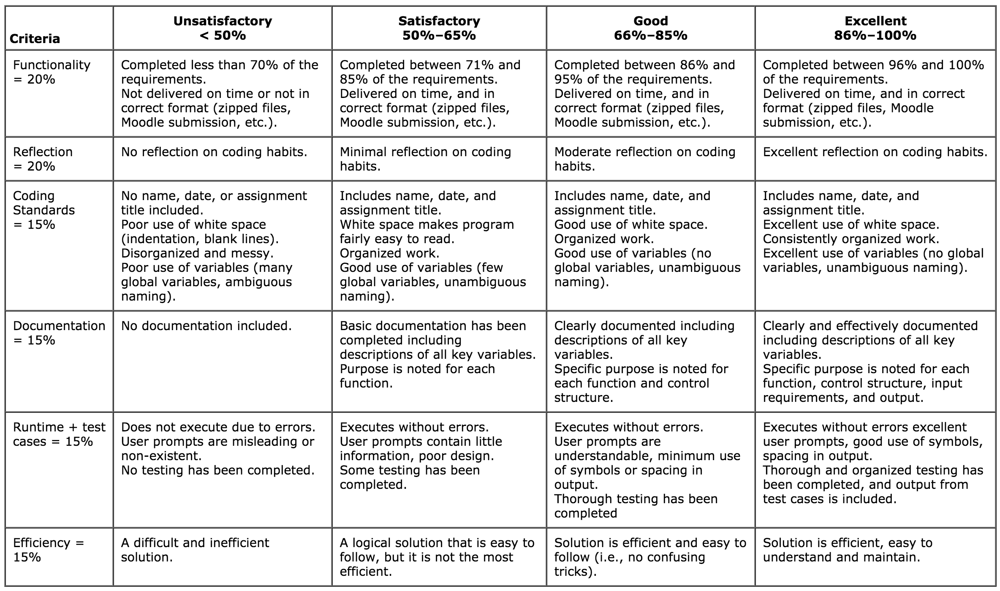

# COMP272: Data Structures and Algorithms (Revision 7)
## Notes
### Abstract Data Type (ADT)
Distinguish the difference between an *interface* and an *implementation*.  
Interface: describes what a data structure does and how you can interact with it  
Implementation: describes how it is done.  

https://en.wikipedia.org/wiki/Abstract_data_type
http://opendatastructures.org/ods-python/1_2_Interfaces.html

#### What are ADTs?

Abstract data types is the interface. List, dictionary, stacks, queues, objects, all have their own way of thinking about data but none of them tell us how the data is stored or what algorithms are used to process the data.

From the point of view of the user
Purely theoretical


#### Queue's
Item's added and removed from a data structure in order.

##### Deque (Double Ended Queue)
interface: `addFirst | addLast | removeFirst | removeLast`  
Can implement both LIFO and FIFO queues.

##### FIFO (First in, First out)
interface: `add queue addFirst | remove dequeue removeLast`

##### Stack aka LIFO (Last in, First out)
interface: `push addFirst | pop removeFirst`

##### Priority Queue
This queue has some kind of prioritization that occurs during the add method.  
interface: `insert_with_priority | pop_next_priority_element deleteMin`

#### List or sequence
Lists essentially replace all the benefits of Queue's:



x_1,x_2,...,x_(n-1)
 - `size()`: returns length of list
 - `get(i)`: returns x_i
 - `set(i, y)`: sets x_i to y
 - `add(i, y)`: add x at position i, moving *x_i,...,x_(n−1)* => *x_(i+1),...,x_(n−1+1)*
 - `remove(i)`: remove the value x_i, moving *x_(i+1),...,x_(n−1)* => *x_i),...,x_(n−1-1)*

#### Sets

##### Unordered Set (Uset or Mathematical Set)
This is the basis of dictionaries or named arrays. Each item can be stored as a pair of items.

- `size()`: return the number of elements in the set
- `add(x)`: add the element x to the set if not already present. Return true if x was added to the set and false otherwise.
- `remove(x)`: remove x from the set. Return x, or null if no such element exists.
- `find(x)`: find x in the set if it exists. Return y, or null if no such element exists.


##### Ordered Set (SSet)
Only add and find are different.
- `add(x)`: add element in sorted order
- `find(x)`: Find smallest element y, such that y ≥ x. Return y or null if no such element exists.

#### Containers
Pointers to another object

#### Graph

### Mathematical Background

#### Exponentials

#### Logarithms

#### Factorials

Stirling's Approximation

#### Binomial Coefficients

#### Sets and Set Membership

* \(x \in A\): x is an element of A
* \(B \subset A\): B is a subset of A

#### Asymptotic Notation
Upper and lower bounds of running time.
Only takes into consideration the most powerful component.
Any constant can be used to make the function larger or smaller to fit the bounds.

Θ(g(n)) = {f(n): there exist positive constants \(c_1\) , \(c_1\), and \(n_0\) such that  
\(c_2∙g(n) \geq f(n) \geq c_1∙g(n) \geq 0 for all n \geq n_0\)}
- \(n_0\): minimum possible value
- \(c_1\): constant that defines lower bound
- \(c_2\): constant that defines upper bound

Big O: Upper bound  
Big \(\Omega\): Lower bound  
Big \(\Theta\): Upper and lower bound  

There are a few assumptions about the functions.

- Asymptotically non-negative: only works in the positive quadrant

Example of how to calculate constants & lower value: Intro to Alg(pg 46)

$$
c_{1}n^2 \leq \frac{1}{2}n^2 - 3n \leq c_{2}n^2
$$

For all \(n \geq n_0\). Dividing by n^2 yields

$$
c_{1} \leq \frac{1}{2} - \frac{3}{n} \leq c_{2}
$$


### Analysis

#### The RAM (Random Access Machine) Model of Computation
TODO: apply a model of computation.

RAM model (W-bit machine)

Still don't understand how memory works in this model (w-bit word)

How do we calculate algorithm costs?
We use a model.
The model is based on memory, operators, and pointers.

1 processor: instructions are executed one after another  
cells(RAM): holds a w-bit word  
operations: arithmetic (add, subtract, multiply, divide, remainder, floor, ceiling)  
- data movement (load, store, copy)
- control (conditional and unconditional branch, subroutine call and return)

Some of these assumptions are not true about computers, however, they are close enough to be useful without being overly complicated.
The RAM model does not account for the memory hierarchy (cache, ram, drive)


### Recursion
### Amortization
### Divide-and-conquer
### Prune-and-search (aka decrease-and-conquer)
### Brute force
### The greedy method
### Dynamic programming
## Interesting Algorithms
### Fisher-Yates shuffle
https://blog.codinghorror.com/the-danger-of-naivete/

```java
int[] cards = {1-n}; // cards from 1 to n

for (int i = cards.Length - 1; i > 0; i--) {
    int n = rand.Next(i + 1);
    Swap(ref cards[i], ref cards[n]);
}
```

Randomly swaps the last card with itself or any card smaller.
Randomly swaps the second last card with itself or any card smaller.
Continues until the second smallest card.


## Guidelines for Marking Programming Assignments

The following table presents the overall approach to marking a program.
The first column lists the five key criteria on which your program will be marked.
*Functionality* is the main criterion.
The rest of them will receive proportionally reduced marks depending on the percentage of functionality implemented in the program.
If you have implemented only half the functionality expected in the program, don’t expect to receive full marks for documentation, test cases, and so on.



## Unit 1: Introduction


### 1.5 Properties used to analyse algorithms
Algorithms are generally analysed based on Correctness, Time Complexity, and Space Complexity.
TODO: apply correctness, time complexity, and space complexity to data structures and algorithms.

#### Correctness
Accuracy of the algorithm's result.  
This is generally the highest concern of an algorithm since dependably calculating results is usually the most valuable feature of an algorithm. However, a less accurate algorithm may be useful for complicated problems where a accurate solution is too time consuming.

#### Time Complexity
The running time of an algorithm.  
Next to accuracy, time complexity is the next most optimized property. Algorithms are most often compared based on this property since space is generally inexpensive, and correctness is usually assumed.

- Worst-case running times
: The slowest possible time an algorithm can take. ie. Bubble sorting a list that is in reverse sorted order.

- Amortized running times
: Worst case running time of a sequence of n actions.
O(m) represents that if m operations are completed the total running time will not exceed O(m) even though a specific operation may be a larger order function.
A good example of this is the resize operation within a deque, or list operation. Even though the resize operation is expensive it is performed in proportion to the number of other operations in the sequence.

- Expected running times
: A type of probabilistic analysis where a random dataset is used to determine an average running time based on randomized dataset.

#### Space Complexity
The amount of memory needed for an algorithm.  
Except in specific cases space is not a large factor in the usefulness of an algorithm, since memory is relatively inexpensive compared to computing power and correctness.

## Unit 2: Array-Based Lists

### Study Activities
Study the following sections from Pat Morin's textbook:

#### 2.1 Array Stack
Fast Stack Operations Using an Array
FILO stack that is implemented using an array.

Add in the middle of an array:
    1. check if array is long enough
        1. resize if not big enough
    1. move items over (for loop)
    1. assign element

Remove for middle of array:
    1. move items left starting at item right of the item to be removed (for loop)
    1. check if array is too long
        1. resize

2.2 FastArrayStack: An Optimized ArrayStack: 
There are functions that are more efficient than for loops for copying and moving elements in an array.  
C: `memcpy(d, s, n)` and `memmove(d, s, n)`  
C++: `std :: copy(a0, a1, b)`  
Java: `System.arraycopy(s,i,d,j,n)`  

#### 2.3 Array Queue
An Array-Based Queue
FIFO queue implemented with an "unlimited" array.
This array only ever has to be n elements long, where n is the number of items in the queue.
This is accomplished by wrapping around the end point.
This is accomplished using an integer to represent the first and last position of the queue.
These positions are incremented and decremented as if they were part of an unlimitedly long queue.
To find the index of first or last element a modulo over the size of the array is performed.
Checking if the array is to large is accomplished by taking the delta of the first and last number and comparing it to the size of the array.
The array is empty if the first and last positions are equal.
Growing or shrinking the array is accomplished using by copying to a new array and resetting the index.

#### 2.4 Array Deque
Fast Deque Operations Using an Array
By treating the Deque as an "unlimited length" array we can use the same wrapping technique to optimize the shifting by only every making the shortest shift.
This is done by shifting on the left when the item to be shifted is on the left side and shifting on the right when the item is on the right side of centre.
This optimizes for the smallest number of elements to be shifted.

#### 2.5 Dual Array Deque
Building a Deque from Two Stacks

This is a fringe case that isn't actually useful in production. It is useful in order to show an implementation using two queues.

#### 2.6 RootishArrayStack: A Space-Efficient Array Stack

The benefit of this structure is reduced size.

An array of array's n deep. Each sub-array has b elements where b is the block number.

  | 123456
--|-------
0 | x
1 | xx
2 | xxx

Because of the complicated structure finding any given item is more complicated since each index needs to be translated into a block and item index.

The block and the item both require equations to find.

### Questions

TODO: ask about how to "Test the performance"
    In Exercise 2.9 it says to "Test the performance of your implementation against the ArrayDeque." This has not been covered in the course so far and I'm wondering how/where to learn this.

TODO: implement [List] interfaces.
TODO: implement [Queue] interfaces.
TODO: Go through the discussion and exercises at the end of Chapter 2; use the Unit 2 outcomes as a focus for your activities.

## Unit 3: Linked Lists

### Learning Outcomes

- implement singly-linked lists.
- implement doubly-linked lists.
- implement space-efficient linked lists.

### Study Activities

#### 3.1 SLList: A Singly-Linked List

#### 3.2 DLList: A Doubly-Linked List

#### 3.3 SEList: A Space-Efficient Linked List

### Excercises
Go to Data Structure Visualizations at
<http://www.cs.usfca.edu/~galles/visualization/Algorithms.html>, and try
the following:

- [Stack: Linked List Implementation](http://www.cs.usfca.edu/~galles/visualization/StackLL.html)
- [Queues: Linked List Implementation](http://www.cs.usfca.edu/~galles/visualization/QueueLL.html)
- Lists: Array Implementation (available in [Java](http://www.cs.usfca.edu/~galles/visualization/java/visualization.html) version)
- Lists: Linked List Implementation (available in [Java](http://www.cs.usfca.edu/~galles/visualization/java/visualization.html) version)

### Review
- Check the desired learning outcomes at the beginning of this unit. Go through the discussion and exercises at the end of Chapter 3; use the Unit 3 outcomes as a focus for your activities. Post to the Unit 3 discussion forum if you have questions. Check the Unit 3 discussion forum to see if you can answer a question someone else has posted or share a link to an online resource you have found useful. Look at Assignment 1 on the course home page—how much can you do at this point? Plan to revise your attempts before your final submission.

## Unit 4: Skiplists

### Learning Outcomes

- implement skiplists.

### Study Activities

#### 4.1 The Basic Structure

#### 4.2 SkiplistSSet: An Efficient SSet

#### 4.3 SkiplistList: An Efficient Random-Access List

#### 4.4 Analysis of Skiplists

### Review
- Check the desired learning outcomes at the beginning of this unit. Go through the discussion and exercises at the end of Chapter 4; use the Unit 4 outcomes as a focus for your activities. Post to the Unit 4 discussion forum if you have questions. Check the Unit 4 discussion forum to see if you can answer a question someone else has posted or share a link to an online resource you have found useful.

## Assignment 1 (due Dec 23rd, 2017)
min 50%, worth 20%

Answer question 1, question 2, and any other 2 questions from questions 3 to 6 – maximum 100 marks. You must score at least 50 to pass the assignment.

1. (25 + 15 = 40 marks) You have learned some fundamental data structure concepts such as array, queue and priority queue, stack, list and linked list, sequence, and unordered set, and you understand the concept of interface or abstract data type that defines the set of operations supported by a data structure and the semantics, or meaning, of those operations. You can use the interface of one particular data structure to define or implement the operations of a different data structure.
    a. (25 marks total) Describe the meaning of the essential methods add(x), deleteMin(), and size() that are supported by the priority queue interface (5 marks). Implement those methods using a singly-linked list (5 marks for each method). Analyze the running time of the add(x) and deletMin() operations based on this implementation (5 marks).
    b. (15 marks total) Implement the stack methods push(x) and pop() using two queues (5 marks for each method). Analyze the running time of the push(x) and pop() operations based on this implementation (5 marks).
2. (10 + 10 = 20 marks) Swap two adjacent elements in a list by adjusting only the links (and not the data) using
    a. singly-linked list (10 marks).
    b. doubly-linked list (10 marks).
3. (20 marks) Exercise 1.5. Using a USet, implement a Bag. A Bag is like a USet—it supports the add(x), remove(x), and find(x) methods—but it allows duplicate elements to be stored. The find(x) operation in a Bag returns some element (if any) that is equal to x. In addition, a Bag supports the findAll(x) operation that returns a list of all elements in the Bag that are equal to x.
4. (20 marks) Exercise 2.3. Design and implement a RandomQueue. This is an implementation of the Queue interface in which the remove() operation removes an element that is chosen uniformly at random among all the elements currently in the queue. (Think of a RandomQueue as a bag in which we can add elements or reach in and blindly remove some random element.) The add(x) and remove() operations in a RandomQueue should run in constant time per operation.
5. (20 marks) Exercise 3.12. Write a method, reverse(), that reverses the order of elements in a DLList.
6. (20 marks) Exercise 3.14. Design and implement a MinStack data structure that can store comparable elements and supports the stack operations push(x), pop(), and size(), as well as the min() operation, which returns the minimum value currently stored in the data structure. All operations should run in constant time.

## Unit 5: Hash Tables

### Learning Outcomes

After completing Unit 5, you should be able to

- explain hash functions (division, multiplication, folding, radix transformation, digit rearrangement, length-dependent, mid-square).
- estimate the effectiveness of hash functions (division, multiplication, folding, radix transformation, digit rearrangement, length-dependent, mid-square).
- differentiate between various hash functions (division, multiplication, folding, radix transformation, digit rearrangement, length-dependent, mid-square).
- recognize various collision resolution algorithms—open addressing (linear probing, quadratic probing, double hashing), separate chaining (normal, with list heads, with other data structures), coalesced hashing, robin hood hashing, cuckoo hashing, hopscotch hashing, dynamic resizing (resizing the whole, incremental resizing).
- implement hash tables.
- implement collision detection in hash tables.
- analyze collision detection in hash tables.
- develop hash codes.

### Study Activities

*Hashing* is a very efficient technique for storing and retrieving data.
Based on arrays, it works by storing items in a location within a hash
table calculated by a special hash function. Well-designed hash tables
can outperform binary search trees. They are so useful that Java’s
designers saw fit to add a [hashCode]
(all other Java objects are implicitly extensions of [Object]).
In this unit, we will look at the details of implementing different
types of hash tables.

Hashing is a technique that can store a large volume of data in a
special table. Each data item, given its search key, is indexed into the
table using a hash function. In short, the hash function maps the search
key into an index. The index points to a slot in the table. The slots
are called *buckets*.

It is quite possible that multiple search keys may map into a single
bucket. When this happens the search keys are said to experience
*collision*, and a *collision resolution scheme* is needed to
distinguish these search keys.

In practice, hashing gives [*O*(1)] access time to a data item in
the table, but in theory the worst case offers [*O*(n)] for
access time.

Study the following sections from Pat Morin's textbook on key topics in
hashing before looking at the more detailed notes below:

5.1 ChainedHashTable: Hashing with Chaining

5.2 LinearHashTable: Linear Probing

5.3 Hash Codes

Let us try to consolidate your understanding of hashing with an example
of the hash function: [h(k) = k mod m]. Here, h is the hash
function that takes k as an argument. *m* is a chosen prime number; k
mod m will return a hash value from 0 to m – 1. In Java, this function
can be applied as [h(k) = k % m].

Suppose our task is to store all phone book names in a hash table. One
of the input data is a name from the telephone book, say *Dr Who*. We
need to find a consistent mechanism to convert the raw input—the name—to
an associated number. For instance, one may take the positional value,
an integer, of each letter in the alphabet, and add all these values to
arrive at the search key. *Dr Who* would be 4 + 18 + 0 +23 + 8 + 15 =
68. Here, the empty space character is assigned a value of 0. So k = 68.

In the hash function example, m is typically a prime number (for a good
reason: the modulo of a prime number tends to return highly distributed
values). Using the expression (k mod m), one can expect the search key k
to be mapped into a hash value in the range of 0 to m – 1. For example,
68 mod 11 = 2, where 2 is the hash value.

Similarly, each telephone entry could be mapped onto its corresponding
hash value using the (k mod m) hash function.

Let us take the example further by assuming that the table contains 20
empty slots (buckets), of which only the first 11 are shown in the
figure below. The hash function is modulus 11. The prime value 11 in the
hash function has nothing to do with the number of slots in the table.
Let us also assume that the default value of each slot in the table is
set to −1.

Let us say that a set of seven raw data items is translated into the
following search keys: 24, 2, 33, 19, 56, 4, and 45. Once we find the
hash values of the search keys, we can store the corresponding raw data
items in the table using these hash values.

For the first k value 24, the hash function 24 % 11 returns a hash value
of 2. In the table, the index slot 2 is empty; so store the key 24 in
slot 2.

For the next k value 2, the hash function 2 % 11 also returns a hash
value of 2. This time, the index slot 2 is ***not*** empty; look for the
next free slot in the table, which is 3; so store the search key 2 in
slot 3.

Apply the hash function for the rest of the keys, and identify their
storage locations in the table. We’ll assume that the corresponding raw
data would be stored in a separate array corresponding to these hash
values.

  - -- --- --- --- --- --- --- --- --- --- ----
  0   1   2   3   4   5   6   7   8   9   10
  - -- --- --- --- --- --- --- --- --- --- ----

  - ------- -------- -------- ------- ------- -------- -------- -------- -------- -------- --------
  **33**   **56**   **24**   **2**   **4**   **45**   **−1**   **−1**   **19**   **−1**   **−1**
  - ------- -------- -------- ------- ------- -------- -------- -------- -------- -------- --------

As you can see from the resulting table, keys 2 and 45 are not stored in
slots suggested by the hash function because those slots were already
filled up by other keys.

In general, this is how hashing works. Now, for practice, try to hash a
few more numbers and identify their slots in the array.

The hash function that we saw earlier (mod m) belongs to a type called
*division hashing.*

### Division Hashing

Division hashing using a prime number is quite popular. Here is a list
of prime numbers that you can use and the range in which they are
effective:

> 53 – 2^5^ to 2^6^
> 97 – 2^6^ to 2^7^
> 193 – 2^7^ to 2^8^
> 389 – 2^8^ to 2^9^
> 769 – 2^9^ to 2^10^

**Note**: PlanetMath.org
(<http://planetmath.org/encyclopedia/GoodHashTablePrimes.html>) offers a
more comprehensive list of useful primes for hash functions.

The search keys that we intend to hash can range from simple numbers to
the entire text content of a book. The original object could be textual
or numerical or in any medium. We need to convert each object into its
equivalent numerical representation in preparation for hashing. That is,
objects are referenced by search keys.

A hash function must guarantee that the number it returns is a valid
index to one of the table slots. A simple way is to use (k modulo [ TableSize]).

**Example**: Suppose we intend to hash strings; i.e., the table is to
store strings. A very simple hash function would be to add up the ASCII
values of all the characters in the string and take the modulo of the
table size, say 97.

Thus *cobb* would be stored at the location
( 64 +3 + 64 + 15 + 64 + 2 + 64 + 2) % 97 = 88

*hike* would be stored at the location
( 64 + 8 + 64 + 9 + 64 + 11 + 64 + 5) % 97 = 2

*ppqq* would be stored at the location
( 64 + 16 + 64 + 16 + 64 + 17 + 64 + 17) % 97 = 35

*abcd* would be stored at the location
(64 + 1 + 64 + 2 + 64 + 3 + 64 + 4) % 97 = 76

The key idea is to get numbers far away from each other.

A better hashing function for a string s0 s2 s1… sN given a table size

[[(ascii(s0) \* 1280 + (ascii(s1) \* 1281 + (ascii(s2) \* 1282 +…+
(ascii(sN) * 128N \] % TableSize]

The computation of the hashing function is very likely to fail for large
strings because of overflow in various terms. This failure can be
avoided by using *Horner’s rule*, using mod at each stage of
computation:

Given a polynomial of degree n,

> [p(x) = anxn + an−1xn − 1 + ... + a1x1 + a0]

One might suspect that n + (n − 1) + (n − 2) +. ..+ 1 = n(n + 1)/2
multiplications would be needed to evaluate p(x) for a given x. However
Horner’s rule shows that it can be rewritten so that only n
multiplications are needed:

> [p(x) = (((anx + an−1)x + a1)x + ... a1)x + a0]

This is exactly the way that integer constants are evaluated from
strings of characters (digits):

> 12345 = 1 * 104 + 2 \* 103 + 3 \* 102 + 4 \* 101 + 5 \* 100\
> = ((1 * 10 + 2) \* 10 + 3 \* 10 + 4) \* 10 + 5

Use of Horner’s rule would imply computing the above function in the
following fashion:

> [ascii(s0) + 128(ascii(s1) + 128(ascii(s2) + ... + (128(ascii(sN-1) + 128 ascii(sN))...))]

### Multiplication Hashing

Multiplication hashing uses multiplication by a real number and then a
truncation of the integer. Intuitively, we can expect that multiplying a
random real number between 0 and 1 with an integer key should give us
another random real number. Taking the decimal part of this result
should give us most of the digits of precision (i.e., randomness) of the
original. The decimal part also restricts output to a range of values.

A good value of the real number to be used in multiplication hashing is
c = ((sqrt(5) − 1) / 2). Thus,

> h(k) = | m * (k \* c − | k \* c | ) |, and 0 &lt; c &lt; 1.

Here, the key k is multiplied by the constant real number c, where 0
&lt; c &lt; 1. We then take the fractional part of k * c. Multiply this
value by m. Note that the value of m does not make a difference. Take
the floor of the result, which is the hash value of k.

Suppose the size of the table, m, is 1301:

> For k = 1234, h(k) = 850
> For k = 1235, h(k) = 353
> For k = 1236, h(k) = 115
> For k = 1237, h(k) = 660
> For k = 1238, h(k) = 164
> For k = 1239, h(k) = 968
> For k = 1240, h(k) = 471

As you can see, the hash function breaks the input pattern fairly
uniformly.

The division and multiplication hash functions are not *order
preserving*. That is, the original order of objects is not the same as
the order in which the hashed values are stored in the table.

> i.e., k1 &lt; k2 =&gt; h(k1) &lt; h(k2)

Also, the division and multiplication hash functions are not perfect or
minimal perfect hash functions. A *minimal perfect hash* maps n keys to
a range of n elements with no collisions. A *perfect hash* maps n keys
to a range of m elements, m &gt;= n, with no collisions. Refer to
<http://cmph.sourceforge.net/> for additional information about
algorithms that can generate minimal perfect hashing.

### Folding Hashing

This method divides the original object or the search key into several
parts, adds the parts together, and then uses the last four digits (or
some other arbitrary number of digits) as the hashed value or key. For
example, a social insurance number 123 456 789 can be broken into three
parts: 123, 456, and 789. These three numbers are added, yielding the
position as 1368. The hash function will be 1368 % [TableSize].

The folding can be done in number of ways. For instance, one can divide
the number into four parts: 12, 34, 56, 789, and add them together.

### Radix Transformation

The number base (or *radix*) of the search key can be changed, resulting
in a different sequence of digits. For example, a decimal numbered key
could be transformed into a hexadecimal numbered key. High-order digits
could be discarded to fit a hash value of uniform length. For instance,
if our key is 23 in base 10, we might convert it to 32 in base 7. We
then use the division method to obtain a hash value.

### Digit Rearrangement

Here, the search key digits, say in positions 3 through 6, are reversed,
resulting in a new search key.

For example, if our key is 1234567, we might select the digits in
positions 2 through 4, yielding 234. The manipulation can then take many
forms:

- reversing the digits – 432, resulting in a key of 1432567
- performing a circular shift to the right – 423, resulting in a key of 1423567
- performing a circular shift to the left – 342, resulting in a key of 1342567
- swapping each pair of digits – 324, resulting in a key of 1324567.

### Length-Dependent Hashing

In this method, the key and the length of the key are combined in some
way to form either the index itself or an intermediate version. For
example, if our key is 8765, we might multiply the first two digits by
the length and then divide by the last digit, yielding 69. If our table
size is 43, we would then use the division method, resulting in an index
of 26.

### Mid-Square Hashing

The key is squared, and the middle part of the result is used as address
for the hash table. The entire key participates in generating the
address so that there is a better chance that different addresses are
generated even for keys close to each other. For example,

> suppose the key is 3121, the square is 9740641, and the mid value is
> 406
> suppose the key is 3122, the square is 9746884, and the mid value is
> 468
> suppose the key is 3123, the square is 9753129, and the mid value is
> 531

In practice, it is more efficient to choose a power of 2 for the size of
the table and extract the middle part of the bit representation of the
square of a key. If the table size is chosen in this example as 1024,
the binary representation of square of 3121 is
1001010-0101000010-1100001.

The middle part can be easily extracted using a mask and a shift
operation.

### Resolving Hash Collisions

http://www.cs.ucf.edu/~dmarino/ucf/cop3502/lec_biswas/hashingB.pdf

Collisions happen when two search keys are hashed into the same slot in
the table. There are many ways to resolve collision in hashing.
Alternatively, one can discover a hash function that is perfect—meaning
that it maps each search key into a different hash value. Unfortunately,
perfect hash functions are effective only in situations where the inputs
are fixed and known in advance. A sub-category of perfect hash is
*minimal perfect hash*, where the range of the hash values is also
limited, yielding a compact hash table.

If we are able to develop a perfect hashing function, we do not need to
be concerned about collisions or table size. However, often we do not
know the size of the input dataset and are not able to develop a perfect
hashing function. In these cases, we must choose a method for handling
collisions.

For almost all hash functions, it is possible that more than one key is
assigned to the same table slot. For example, if the hash function
computes the slot based just on the first letter of the key, then all
keys starting with the same letter will be hashed to the same slot,
resulting in a collision.

Collision can be resolved partially by choosing another hash function,
which computes the slot based on first two letters of the key. However,
even if a hash function is chosen in which all the letters of the key
participate, there is still a possibility that a number of keys may hash
to the same slot in the hash table.

Another factor that can be used to avoid collision of multiple keys is
the size of the hash table. A larger size will result in fewer
collisions, but that will also increase the access time during
retrieval.

A number of strategies have been proposed to prevent collision of
multiple keys. Strategies that look for another open position in the
table other than the one to which the slot is originally hashed are
called *open addressing* strategies. We will examine three open
addressing strategies: *linear probing*, *quadratic probing*, and
*double hashing*.

#### Linear Probing

When a collision takes place, you should search for the next available
position in the table by making a sequential search. Thus the hash
values are generated by

> after-collision: [h(k, i) = [h(k) + p(i) \] mod TableSize],

where p(i) is the probing function after the i^t^h probe. The probing
function is one that looks for the next available slot in case of a
collision. The simplest probing function is linear probing, for which
p(i) = i, where i is the step size.

Consider a simple example with table of size 10, hence mod 10. After
hashing keys 22, 9, and 43, the table is shown below. Note that
initially a simple division hashing function, h(k) = k mod

h(k, i) = [h(k) + i \] mod [TableSize], only when there is a
collision.

+------+------+------+------+------+------+------+------+------+------+
| 0    | 1    | 2    | 3    | 4    | 5    | 6    | 7    | 8    | 9    |
+------+------+------+------+------+------+------+------+------+------+
|      |      | 22   | 43   |      |      |      |      |      | 9    |
+------+------+------+------+------+------+------+------+------+------+

When keys 32 and 65 arrive, they are stored as follows. Note that the
search key 32 results in a hash value of 2, but slot 2 is already
occupied. Thus, using the modified hash function, with i = 1, a new hash
value of 3 is obtained. However, slot 3 is also occupied, so we reapply
the modified hash function. This results in a slot value of 4 that
houses the search key 32. The search key 65 directly hashes to slot 5.

+------+------+------+------+------+------+------+------+------+------+
| 0    | 1    | 2    | 3    | 4    | 5    | 6    | 7    | 8    | 9    |
+------+------+------+------+------+------+------+------+------+------+
|      |      | 22   | 43   | 32   | 65   |      |      |      | 9    |
+------+------+------+------+------+------+------+------+------+------+

Suppose we have another key with value of 54. The key 54 cannot be
stored in its designated place because it collides with 32, so a new
place for it is found by linear probing to position 6, which is empty at
this point:

+------+------+------+------+------+------+------+------+------+------+
| 0    | 1    | 2    | 3    | 4    | 5    | 6    | 7    | 8    | 9    |
+------+------+------+------+------+------+------+------+------+------+
|      |      | 22   | 43   | 32   | 65   | 54   |      |      | 9    |
+------+------+------+------+------+------+------+------+------+------+

When the search reaches end of the table, it continues from the first
location again. Thus the key 59 will be stored as follows:

+------+------+------+------+------+------+------+------+------+------+
| 0    | 1    | 2    | 3    | 4    | 5    | 6    | 7    | 8    | 9    |
+------+------+------+------+------+------+------+------+------+------+
| 59   |      | 22   | 43   | 32   | 65   | 54   |      |      | 9    |
+------+------+------+------+------+------+------+------+------+------+

In linear probing, the keys start forming clusters, which have a
tendency to grow fast because more and more collisions take place and
the new keys get attached to one end of the cluster. These are called
*primary clusters*.

The problem with such clusters is that they generate unsuccessful
searches. The search must go through to the end of the table and start
from the beginning of the table.

#### Quadratic Probing

To overcome the primary clustering problem, quadratic probing places the
elements further away rather than in immediate succession.

Let h(k) be the hash function that maps a search key k to an integer in
[0, m − 1\]. Here m is the size of the table. One choice is the
following quadratic function for the i^th^ probe. That is, the modified
hash function is used to probe only after a collision has been observed.

> after collision: [h(k, i) = h(k) + c~1~i + c2i^2^ mod TableSize], where c~2~ is not equal to 0

If c~2~ = 0, then this hash function will become a linear probe. For a
given hash table, the values c~1~ and c~2~ remain constant. For m =
2^n^, a good choice for the constants are c~1~ = c~2~ = ½.

For a prime m &gt; 2, most choices of c~1~ and c~2~ will make h(k,i)
distinct for i in [0,(m − 1) / 2\]. Such choices include c~1~ = c~2~ =
1/2, c~1~ = c~2~ = 1, and c~1~ = 0, c~2~ = 1.

Although using quadratic probing gives much better results than using
linear probing, the problem of cluster buildup is not avoided
altogether. Such clusters are called *secondary clusters*.

### Double Hashing

The problem of secondary clustering is best addressed with double
hashing. A second function is used for resolving conflicts.

Like linear probing, double hashing uses one hash value as a starting
point and then repeatedly steps forward an interval until the desired
value is located, an empty location is reached, or the entire table has
been searched. But the resulting interval is decided using a second,
independent hash function; hence the name double hashing. Given
independent hash functions h1 and h2, the j^th^ probing for value k in a
hash table of size m is

> h(k, j) = h1(k) + j * h2(k)) mod m

Whatever scheme is used for hashing, it is obvious that the search time
depends on how much of the table is filled up. The search time increases
with the number of elements in the table. In the worst case, one may
have to go through all the table entries.

Similar to other open addressing techniques, double hashing becomes
linear as the hash table approaches maximum capacity. Also, it is
possible for the secondary hash function to evaluate to zero, for
example, if we choose k = 5 with the following function: h2(k) = 5 – (k
mod 7).

### Separate Chaining

A popular and space-efficient alternative to the above schemes is
*separate chaining* hashing. Each position of the table is associated
with a linked list or chain of structures whose data field stores the
keys. The hashing table is a table of references to these linked lists.
Thus, the keys 78, 8, 38, 28, and 58 would hash to the same position,
position 8, in the reference hash table.

In this scheme, the table can never overflow, because the linked lists
are extended only upon the arrival of new keys. A new key is always
added to the front of the linked list, thus minimizing storage time.
Many unsuccessful searches may end up in empty lists, which reduce the
search time of other hashing schemes. This is of course at the expense
of extra storage for linked-list references. While searching for a key,
you must first locate the slot using the hash function and then search
through the linked list for the specific entry.

Here is a figure with a more concrete example on separate chaining:

<http://en.wikipedia.org/wiki/File:Hash_table_5_0_1_1_1_1_1_LL.svg>[::]

_files/unit_05_clip_image001.jpg){width="453"
height="291"}

In this example, John Smith and Sandra Dee end up in the same bucket:
table entry 152. Entry 152 points first to the John Smith object, which
is linked to the Sandra Dee object.
Insertion of a new key requires appending to either end of the list in
the hashed slot.

Deletion requires searching the list and removing the element.

Study carefully and thoroughly the section titled “Separate Chaining” in
<http://en.wikipedia.org/wiki/Separate_chaining#Separate_chaining>,
particularly the two different types of separate chaining—separate
chaining with list heads and separate chaining with other structures.

This web page also introduces you to coalesced hashing, Robin Hood
hashing, cuckoo hashing, and hopscotch hashing, which may help you
understand how they differ from each other.

- Check the desired learning outcomes at the beginning of this unit. Using the Unit 5 outcomes for guidance, try writing out the definitions given in your own words without looking at the textbook. Go through the exercises at the end of Chapter 5; use the Unit 5 outcomes as a focus for your activities. Post to the Unit 5 discussion forum if you have questions. Check the Unit 5 discussion forum to see if you can answer a question someone else has posted or share a link to an online resource you have found useful. Look at Assignment 2 on the course home page—how much can you do at this point? Plan to revise your attempts before your final submission.

## Unit 6: Recursion

### Learning Outcomes

After completing Unit 6, you should be able to

- define *recursion*.
- inspect recursive programs.
- create different types of recursive programs.
- differentiate recursive solutions from iterative solutions.
- estimate the time complexity of recursive programs.

### Study Activities

Recursion is a wonderful programming tool. It provides a simple,
powerful way of approaching a variety of problems. It is often hard,
however, to see how a problem can be approached recursively; it can be
hard to “think recursively.” It is also easy to write a recursive
program that either takes too long to run or doesn’t properly terminate
at all. In this unit we’ll go over the basics of recursion and hopefully
help you develop, or refine, a very important programming skill.

Study Appendix C in the reference text (Barnett and Tongo’s *[Data
Structures and Algorithms: Annotated Reference with
Examples](http://dotnetslackers.com/Community/files/folders/data-structures-and-algorithms/entry30283.aspx)*)
that introduces you to the concept of recursion.

Let us look at some simple recursive code.

#### Decimal to Binary Representation

Here we keep on dividing the number by 2 recursively until it reduces to
zero, then print the remainders in reverse order.

*Example:* convert decimal number 5 to its binary representation

> 5/2 = 2, remainder is 1
> 2/ 2 = 1, remainder is 0
> 1/2 = 0, remainder is 1

We stop here because the number has been reduced to zero. Now collect
the remainders in reverse order. The binary representation is 101.

*Example:* convert decimal number 11 to its binary representation

> 11/2 = 5, remainder is 1
> 5/2 = 2, remainder is 1
> 2/ 2 = 1, remainder is 0
> 1/2 = 0, remainder is 1

We stop here because the number has been reduced to zero and collect the
remainders in reverse order. The binary representation is 1011.

*Example:* convert decimal number 14 to its binary representation

> 14/ 2 = 7, remainder is 0
> 7/2 = 3, remainder is 1
> 3/2 = 1, remainder is 1
> 1/2 = 0, remainder is 1

We stop here because the number has been reduced to zero and collect the
remainders in reverse order. The binary representation is 1110.

Here is a recursive function (in C++) that prints the binary equivalent
of any given decimal number:

```
void decibinary (int num) {
    if (num < 2)
    {
        printf(“%d”,  num);
    }
    else
    {
        decibinary(num/2);
        printf(“%d”,  num%2);
    }
}
```

#### Printing a String in Reverse Order

Let ss store a string of length n. To print this string in reverse
order, print the last character of the string, and call the function
recursively with size one less than the previous length. The function
can be terminated when there is just a single character to be printed.
Here is the function in C++:

```
void  print_reverse(char ss[], int n) {
    //  Only one character to print, so print it!
    if  (n == 1)
    {
        printf("%c",  ss[0]);
    }
    // Solve the problem recursively: print the last character, then reverse the  substring without that last character.
    else
    {
        printf("%c",  ss[n-1]);
        print_reverse(ss,  n-1);
    }
}
```

#### Checking for Palindromes

Palindrome: a word, phrase, verse, or sentence that reads the same
backward or forward. Here are few palindromes:

> borrow or rob
>
> gateman sees name garageman sees name tag
>
> murder for a jar of red rum
>
> a nut for a jar of tuna

How do you mathematically define a palindrome? Here is a recursive
definition: It is a ‘string’ whose first and last characters match AND
the remaining substring is also a palindrome. According to this
definition, the examples above would be termed palindromes if you
ignored the spaces between the words:

> anutforajaroftuna

The recursive definition can be easily coded into a computer code
segment. It needs the length of the string to be supplied along with the
input string itself. Every time the function is called, it makes sure
that the first and last characters match and then calls itself
recursively after dropping the first and last characters from the
substring.

> nutforajaroftun
>
> utforajaroftu
>
> tforajaroft

Here is the function in C++:

```
int  checkPalindrome (char string[]){
    if ( check (string, strlen (string) ))
    {
        printf("nyes, it is a palindrome\n");
    }
    else
    {
        printf("nNo, it is not a palindrome");
    }
}
```

Function check returns 1 if the remaining characters in the array str
form a palindrome.

```
       int  check ( char str[], int len){
          if ( len <= 1)
          }
             return 1 ;
          }
         else
         {
             // if first and last characters match
             // and the remaining string is a palindrome
             if ( (str[0] == str[len − 1]) &&  check(str + 1, len − 2))
               {
                  return 1;
               }
             else
             {
                return 0;
              }
          }
       }
```

Note that array arithmetic is being used here. Since the first character
of the string is located at memory location [str], the new
substring begins at memory location [str] + 1, and the length of
the new substring is 2 less than that of the current string.

#### The Greatest Common Divisor (GCD)

The GCD of two non-negative integers is the largest integer that divides
evenly into both.

For example, the numbers 2, 3, 4, 6, and 12 divide evenly into the
numbers 24 and 36. So the GCD of 24 and 36 is 12, the largest integer.
The GCD can be obtained by factorizing the numbers and picking up all
the common elements. However, for very large numbers it would involve a
large number of operations. Consider, for example, obtaining the GCD of
129618 and 576234 by factorizing.

In the 3rd century B.C.E., the great mathematician Euclid proposed an
algorithm to find GCD. It was based on the facts that GCD(p, q) = GCD(q,
p), and GCD( p, 0) = p

Euclid’s algorithm:

1.  Make p the larger of two numbers p and q.
2.  Divide p by q. Let r be the remainder. If r is zero, then q is the GCD.
3.  Else, GCD of p and q equals GCD of q and r.

Using this algorithm we can find the GCD of 1296 and 576 as follows:

> GCD(1296,576)
>
> = GCD ( 576, 1296 % 576)
>
> = GCD (576, 144)
>
> = 144 as 144 divides 576 without leaving a remainder.

Here is a full implementation of GCD in recursion using Java:

<http://www.cs.princeton.edu/introcs/23recursion/Euclid.java.html>[::]

```
/*************************************************************************  
 *  Compilation: javac Euclid.java  
 *  Execution: java Euclid p q  
 *   
 * Reads two  command-line arguments p and q and computes the greatest  
 * common  divisor of p and q using Euclid's algorithm.  
 *  
 * Remarks  
 *  -----------  
 * - may  return the negative of the gcd if p is negative  
 *  
 *************************************************************************/
public class Euclid {  
    // recursive implementation  
public static int gcd(int p, int q) {
if (q == 0)
{
return p;
} 
else
{
return gcd(q, p % q);  
}
}  

     // non-recursive  implementation  
public static int gcd2(int p, int q) {  
while (q != 0)
{  
int temp = q;  
q = p % q;  
p = temp;  
}  
return p;  
}  

public static void main(String[] args)  {  
int p = Integer.parseInt(args[0]);  
int q = Integer.parseInt(args[1]);  
int d = gcd(p, q);  
int d2 = gcd2(p, q);  
System.out.println("gcd(" + p + ", " + q + ") = " + d);  
System.out.println("gcd(" + p + ", " + q + ") = " + d2);  
}
}
```

#### More on Recursive Formulations

A recursive program may not terminate if the stopping case is not
correct or is incomplete (stack overflow: run-time error)

Make sure that each recursive step leads to a situation that is closer
to a stopping case.

You can visit the following web page to see examples of recursion with
extensive explanations:

<http://www.topcoder.com/tc?module=Static&d1=tutorials&d2=recursionPt1>

Visit this web page next to see advanced examples of recursion:

<http://www.topcoder.com/tc?module=Static&d1=tutorials&d2=recursionPt2>

#### Time Complexity of Recursion

Study this for an introduction to time complexity of recursive
functions:

Hakan Haberdar, “How to Compute Time Complexity of Recursive
Algorithms”, Computer Science Tutorials [online\], (Accessed
10-18-2016) Available from:
<http://www.haberdar.org/time-complexity-recursive-algorithms-tutorial.htm>

Go to Data Structure Visualizations at
<http://www.cs.usfca.edu/~galles/visualization/Algorithms.html>, and try
the following:

- [Recursive Factorial](http://www.cs.usfca.edu/~galles/visualization/RecFact.html)
- [Recursive Reverse](http://www.cs.usfca.edu/~galles/visualization/RecReverse.html)
- [Recursive N-Queens](http://www.cs.usfca.edu/~galles/visualization/RecQueens.html)

- Check the desired learning outcomes at the beginning of this unit. Try the suggested activities. Post to the Unit 6 discussion forum if you have questions. Check the Unit 6 discussion forum to see if you can answer a question someone else has posted or share a link to an online resource you have found useful. Look at Assignment 2 on the course home page—how much can you do at this point? Plan to revise your attempts before your final submission.

## Unit 7: Binary Trees

### Learning Outcomes

After completing Unit 7, you should be able to

- define *binary tree*.
- define *binary search tree*.
- examine a binary tree and binary search tree.
- implement a binary tree and binary search tree.
- define *AVL tree*.

### Study Activities

Study the following sections from Pat Morin's textbook:

6.1 BinaryTree: A Basic Binary Tree

6.2 BinarySearchTree: An Unbalanced Binary Search Tree

#### AVL Trees

An AVL tree is a self-balancing binary search tree in which the heights
of the two child subtrees of any node differ by at most 1; therefore, it
is also said to be *height-balanced*. Lookup, insertion, and deletion
all take *O*(log n) time in both the average and worst cases, where n is
the number of nodes in the tree prior to the operation. Insertions and
deletions may require the tree to be rebalanced by one or more tree
rotations.

The balance factor of a node is the height of its right subtree minus
the height of its left subtree, and a node with balance factor 1, 0, or
−1 is considered balanced. A node with any other balance factor is
considered unbalanced and requires rebalancing the tree. The balance
factor is either stored directly at each node or computed from the
heights of the subtrees.

AVL trees are often compared to red–black trees (See Unit 9) because
they support the same set of operations and because red−black trees also
take *O*(log n) time for the basic operations. AVL trees perform better
than red–black trees for lookup-intensive applications. AVL trees,
red–black trees, and (2,4) trees, to be introduced in Unit 9 and Chapter
9 of Morin’s book, share a number of good properties, but AVL trees and
(2,4) trees may require some extra operation to deal with restructuring
(rotations), fusing, or splitting. However, red–black trees do not have
these drawbacks.

The following web pages offer excellent introductions to AVL trees:

<http://en.wikipedia.org/wiki/AVL_tree>

<http://www.cs.ucf.edu/~dmarino/ucf/cop3502/lec_biswas/trees5.pdf>

Go to Data Structure Visualizations at
<http://www.cs.usfca.edu/~galles/visualization/Algorithms.html>, and try
the following:

- [Binary Search Tree](http://www.cs.usfca.edu/~galles/visualization/BST.html)
- [AVL Tree (balanced binary search trees)](http://www.cs.usfca.edu/~galles/visualization/AVLtree.html)

- Check the desired learning outcomes at the beginning of this unit. Go through the exercises at the end of Chapter 6; use the Unit 7 outcomes as a focus for your activities. Post to the Unit 7 discussion forum if you have questions. Check the Unit 7 discussion forum to see if you can answer a question someone else has posted or share a link to an online resource you have found useful. Look at Assignment 2—how much can you do at this point? Plan to revise your attempts before your final submission.

## Unit 8: Scapegoat Trees

### Learning Outcomes

After completing Unit 8, you should be able to

- define *scapegoat tree*.
- examine a scapegoat tree.
- implement a scapegoat tree.

### Study Activities

Study the following chapter from Pat Morin’s textbook:

Chapter 8 Scapegoat Trees

- Check the desired learning outcomes at the beginning of this unit. Go through the exercises at the end of Chapter 8; use the Unit 8 outcomes as a focus for your activities. Post to the Unit 8 discussion forum if you have questions. Check the Unit 8 discussion forum to see if you can answer a question someone else has posted or share a link to an online resource you have found useful.

## Assignment 2 (due Dec 30th, 2017)
min 50%, worth 20%

## Unit 9: Red–Black Trees

### Learning Outcomes

After completing Unit 9, you should be able to

- define *red–black tree.*
- examine a red–black tree.
- implement a red–black tree.

### Study Activities

Study the following chapter from Pat Morin’s textbook:

Chapter 9 Red–Black Trees

Go to Data Structure Visualizations at
<http://www.cs.usfca.edu/~galles/visualization/Algorithms.html>, and try
the following:

- [Red–Black Tree](http://www.cs.usfca.edu/~galles/visualization/RedBlack.html)

- Check the desired learning outcomes at the beginning of this unit. Go through the exercises at the end of Chapter 9; use the Unit 9 outcomes as a focus for your activities. Post to the Unit 9 discussion forum if you have questions. Check the Unit 9 discussion forum to see if you can answer a question someone else has posted or share a link to an online resource you have found useful. Look at Assignment 3—how much can you do at this point? Plan to revise your attempts before your final submission. It is important to understand and demonstrate the differences between AVL trees, red–black trees, and (2,4) trees in terms of the key properties of these trees; the process of adding or removing nodes in the trees while maintaining these key properties with appropriate operations; and running time or cost to maintain the properties.

## Unit 10: Heaps

### Learning Outcomes

After completing Unit 10, you should be able to

- define *heap.*
- examine a binary heap tree.
- implement a binary heap tree.
- define *meldable heap.*
- examine a randomized meldable heap.

### Study Activities

A *heap* is a data structure created using a binary tree. It can be seen
as a binary tree with two additional constraints:

1.  The **shape property**: the tree is a *complete binary tree*; that is, all levels of the tree, except possibly the last one (deepest) are fully filled, and, if the last level of the tree is not complete, the nodes of that level are filled from left to right.
2.  The **heap property**: each node is greater than or equal to each of its children according to some comparison predicate which is fixed for the entire data structure.

*Greater than* means according to whatever comparison function is chosen
to sort the heap, not necessarily greater than in the mathematical sense
because the quantities are not always numerical. Heaps where the
comparison function is the mathematical greater than are called
*max-heaps*; those where the comparison function is the mathematical
less than are called *min-heaps*. Conventionally, min-heaps are used
because they are readily applicable for use in priority queues.

Note that the ordering of siblings in a heap is not specified by the
heap property, so the two children of a parent can be freely
interchanged, as long as this does not violate the shape and heap
properties.

The *binary heap* is a special case of the d-ary heap in which d = 2.

Study the following sections from Pat Morin's textbook:

10.1 BinaryTree: An Implicit Binary Tree

10.2 MeldableHeap: A Randomized Meldable Heap

Go to Data Structure Visualizations at
<http://www.cs.usfca.edu/~galles/visualization/Algorithms.html>, and try
the following:

- [Min Heap](http://www.cs.usfca.edu/~galles/visualization/Heap.html)
- [Binomial Queue](http://www.cs.usfca.edu/~galles/visualization/BinomialQueue.html)
- [Fibonacci Heap](http://www.cs.usfca.edu/~galles/visualization/FibonacciHeap.html)
- [Leftist Heap](http://www.cs.usfca.edu/~galles/visualization/LeftistHeap.html)
- [Skew Heap](http://www.cs.usfca.edu/~galles/visualization/SkewHeap.html)

- Check the desired learning outcomes at the beginning of this unit. Go through the exercises at the end of Chapter 10; use the Unit 10 outcomes as a focus for your activities. Post to the Unit 10 discussion forum if you have questions. Check the Unit 10 discussion forum to see if you can answer a question someone else has posted or share a link to an online resource you have found useful. Look at Assignment 3—how much can you do at this point? Plan to revise your attempts before your final submission.

## Unit 11: Sorting Algorithms

### Learning Outcomes

After completing Unit 11, you should be able to

- describe sorting algorithms (merge, quick, heap, counting, radix).
- estimate the complexity of sorting algorithms.
- compare sorting algorithms.

### Study Activities

Study the following chapter from Pat Morin's textbook:

Chapter 11 Sorting Algorithms

Go to Data Structure Visualizations at
<http://www.cs.usfca.edu/~galles/visualization/Algorithms.html>, and try
the following:

- [Comparison Sorting Algorithms](http://www.cs.usfca.edu/~galles/visualization/ComparisonSort.html)
    - Bubble Sort
    - Selection Sort
    - Insertion Sort
    - Shell Sort
    - Merge Sort
    - Quck Sort
- [Bucket Sort](http://www.cs.usfca.edu/~galles/visualization/BucketSort.html)
- [Counting Sort](http://www.cs.usfca.edu/~galles/visualization/CountingSort.html)
- [Radix Sort](http://www.cs.usfca.edu/~galles/visualization/RadixSort.html)
- [Heap Sort](http://www.cs.usfca.edu/~galles/visualization/HeapSort.html)

- Check the desired learning outcomes at the beginning of this unit. Go through the exercises at the end of Chapter 11; use the Unit 11 outcomes as a focus for your activities. Post to the Unit 11 discussion forum if you have questions. Check the Unit 11 discussion forum to see if you can answer a question someone else has posted or share a link to an online resource you have found useful. Look at Assignment 3—how much can you do at this point? Plan to revise your attempts before your final submission.

## Unit 12: Graphs

### Learning Outcomes

After completing Unit 12, you should be able to

- represent a graph by a matrix
- represent a graph in adjacency lists
- understand the execution process of the depth-first-search and bread-first-search algorithms for traversing a graph
- analyze the performance of the depth-first-search and bread-first-search algorithms for traversing a graph
- implement those search algorithms for traversing a graph in pseudo-code or other programming languages, such as Java, C, or C++, etc.

### Study Activities

Study the following sections from Pat Morin's textbook:

12.1 AdjacencyMatrix: Representing a Graph by a Matrix

12.2 AdjacencyLists: A Graph as a Collection of Lists

12.3 Graph Traversal

Go to Data Structure Visualizations at http://www.cs.usfca.edu/~galles/visualization/Algorithms.html, and try the following:

- [Breadth-First Search](http://www.cs.usfca.edu/~galles/visualization/BFS.html)
- [Depth-First Search](http://www.cs.usfca.edu/~galles/visualization/DFS.html)
- [Connected Components](http://www.cs.usfca.edu/~galles/visualization/ConnectedComponent.html)
- [Dijkstra Shortest Path](http://www.cs.usfca.edu/~galles/visualization/Dijkstra.html)
- [Prim Minimum Cost Spanning Treeh](http://www.cs.usfca.edu/~galles/visualization/Prim.html)
- [Topological Sort (Indegree)](http://www.cs.usfca.edu/~galles/visualization/TopoSortIndegree.html)
- [Topological Sort (DFS)](http://www.cs.usfca.edu/~galles/visualization/TopoSortDFS.html)
- [Floyd-Warshall All-Pairs Shortest Path](http://www.cs.usfca.edu/~galles/visualization/Floyd.html)
- [Kruskal Minimum Cost Spanning Treeh](http://www.cs.usfca.edu/~galles/visualization/Kruskal.html)

- Check the desired learning outcomes at the beginning of this unit. Go through the exercises at the end of Chapter 12; use the Unit 12 outcomes as a focus for your activities. Post to the Unit 12 discussion forum if you have questions. Check the Unit 12 discussion forum to see if you can answer a question someone else has posted or share a link to an online resource you have found useful.

## Unit 13: Binary Trie

### Learning Outcomes

After completing Unit 13, you should be able to

- define *trie*. examine a binary trie.
- explain binary trie.

### Study Activities

Study the following section from Pat Morin's textbook:

13.1 Binary Trie: A Digital Search Tree

Go to Data Structure Visualizations at http://www.cs.usfca.edu/~galles/visualization/Algorithms.html, and try the following:

- [B Trees](http://www.cs.usfca.edu/~galles/visualization/BTree.html)
- [B+ Trees](http://www.cs.usfca.edu/~galles/visualization/BPlusTree.html)

- Check the desired learning outcomes at the beginning of this unit. Go through the exercises at the end of Chapter 13; use the Unit 13 outcomes as a focus for your activities. Post to the Unit 13 discussion forum if you have questions. Check the Unit 13 discussion forum to see if you can answer a question someone else has posted or share a link to an online resource you have found useful.

## Assignment 3 (due Jan 6th, 2017)
min 50%, worth 20%

## Final Exam (due Jan 23rd, 2017)
min 50%, worth 40%
So, I wrote the exam. It was fair and reasonably challenging. The sample exam is a good starting point to help you get started with your studying.

My preparation strategy was the following:

1. Reviewed (re-read) all the chapters. It didn't take a whole lot of time the second time through because I didn't have to think through all the details this time, and, I was even better able to skip the mathematical proofs (the only thing I ever looked for was the running time information ;).

2. Reviewed my three assignments. Of course, the way I did my assignments is that I wrote a paragraph (or more) for each question, every time. This meant that my assignments were suitable for studying purposes.

3. Reviewed binary trees since the entire second half of the course used binary trees and the different types of traversal/search techniques.

Oh, and I did of course spend some time looking at the sample exam.

Caution: this worked for me. I make no guarantee that it'll work for you. Ultimately, the approach prepared me reasonably well (I think). The exam tests a multitude of things: your understanding of how to apply algorithms (not overly complicated ones, mind you but certainly ones that get to the heart of the concepts); your ability to describe the operation of an algorithm; your understanding of how some commonly used structures operate; and, of course, the obligatory knowledge and understanding factoids that an exam might test.

In terms of the actual writing, time yourself. I've always been one to take a few moments and decide how much time to allot to each section on the exam. This one was no different. For example, based on points the multiple choice was worth 72 minutes. It took me the better part of 75 minutes to work my way through the multiple choice.

Oh, bring a favourite collection of pens, pencils and erasers and ask for a few sheets of scrap paper to work on (obviously you can't bring your own paper). Unless you have absolutely amazing memory you will be up a creek without a paddle if you don't have paper to write on.
